# Amazon Product Review Analysis

## Introduction

This project analyzes 1,351 Amazon product reviews to uncover trends in pricing, ratings, and customer behavior, showcasing my data analysis skills in `Excel`.

## Methodology

## Data Cleaning
- Removed 114 duplicate `product_id` rows, reduced to 1,351 rows.
- Confirmed no `product_id` duplicates had different `category` using `COUNTIFS`.
- Cleaned `product_name` symbols (e.g., “¬∞”, “→”, “°”), created `clean_product_name`.
- Found four `clean_product_name` duplicates, confirmed valid due to unique `product_id`.
- Filled 2 missing `rating_count` using `AVERAGEIF`.
- Converted `actual_price` (e.g., ₹1,39,900) to numeric, validated min ₹39, max ₹1,39,900.
- Added `price_bucket` for <₹500, ₹500–₹2,000, ₹2,000–₹10,000, ₹10,000–₹50,000, >₹50,000.
- Added `combined_score` as `rating` × `rating_count`.
- Added `short_product_name` by truncating `product_name` to 40 characters, cutting at last space. Manually edited ~5–10 rows to remove trailing “,”, “with”, “for”, “|” (e.g., “Amazon B” → “Amazon Basics Wireless Mouse”). Found ~42 duplicate `short_product_name` values (33 with 3, ~4 with 4, ~5 with 5), confirmed valid due to unique `product_id`. Edited top 5/10 for clarity (e.g., “Amazon Basics High-“ → “Amazon Basics High-Speed HDMI Cable, 6 Feet”).
- Found one product (`product_id`: B08L12N5H1, `product_name`: Pajaka South Indian Filter Coffee Maker 200, `category`: Home & Kitchen) with `rating` = 0, `rating_count` = 922, due to “|”. Replaced with average `rating` for its `category` using `=IF(G2=0, AVERAGEIF(C:C, C2, G:G), G2)`. Fixed `#NAME?` error due to quotes in `AVERAGEIF(‘C’:C, …)`. Updated `combined_score`.
- Added `short_category` by truncating `category` at first “|” for Q2/Q5/Q9/Q13 charts (e.g., “Electronics|Accessories|Cables” → “Electronics”).
- Converted `discount_percentage` from percentage (0.575) to numeric (57.50) for Q1/Q7/Q11/Q13 consistency. Found 47 rows with `discount_percentage` = 0; 46 true zeros (`actual_price` = `discounted_price`), 1 suspicious zero (`actual_price` = ₹699, `discounted_price` = ₹698) corrected to 0.14% using `=ROUND((D[row]-E[row])/D[row],4)`. Fixed Q1 pivot table format to Custom 0.00% to display 57.50%.
- Checked `rating_count`; none > 1,000,000 after cleaning (e.g., 1,878,681 to 426,973).

## Findings
- **Q1: Average Discount by Category**:
  - Home Improvement: 57.50%
  - Computers & Accessories: 53.22%
  - Used `short_category`. Fixed 47 zero `discount_percentage` rows and pivot table format to 0.00%.
- **Q2: Products per Category**:
  - Electronics: 490
  - Home & Kitchen: 448
  - Used `short_category`.
    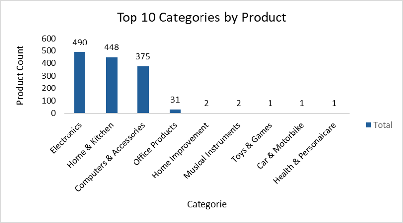
- **Q3: Total Ratings by Category**:
  - Electronics: 14,208,441
  - Used `short_category`.
    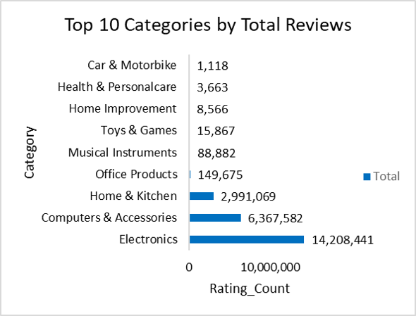
- **Q4: Top-Rated Products**:
  - Syncwire LTG to USB Cable: 5.0
  - REDTECH USB-C to Lightning Cable 3.3FT: 5.0
  - Amazon Basics Wireless Mouse: 5.0
  - Used `short_product_name`, edited duplicates for clarity, valid due to unique `product_id`.
    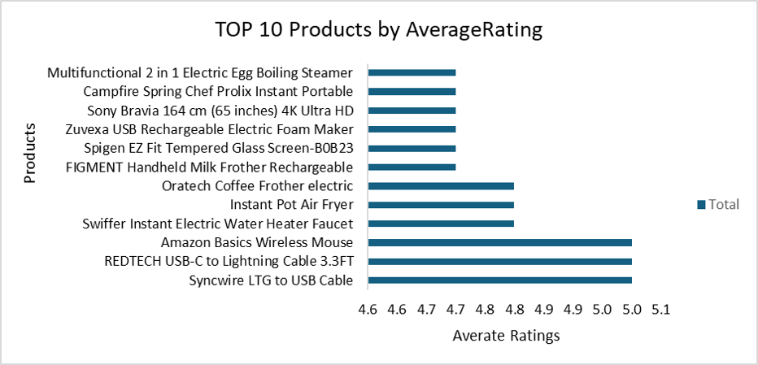
- **Q5: Largest Price Gap by Category**:
  - Electronics: Actual ₹10,418, Discounted ₹6,225
  - Used `short_category`.
    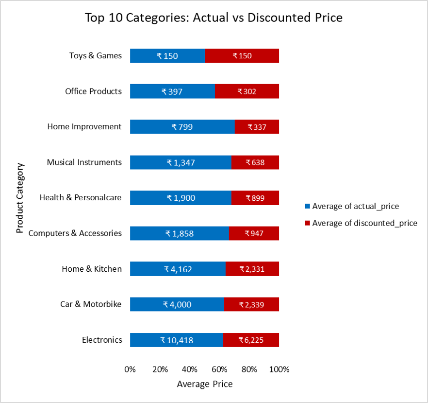
- **Q6: Top Products by Reviews**:
  - Amazon Basics High-Speed HDMI Cable, 6 Feet: 426,973
  - AmazonBasics Flexible Premium HDMI Cable: 426,973
  - Amazon Basics High-Speed HDMI Cable, 6 Feet-B014I: 426,973
  - Used `short_product_name`, edited duplicates, valid due to unique `product_id`.
    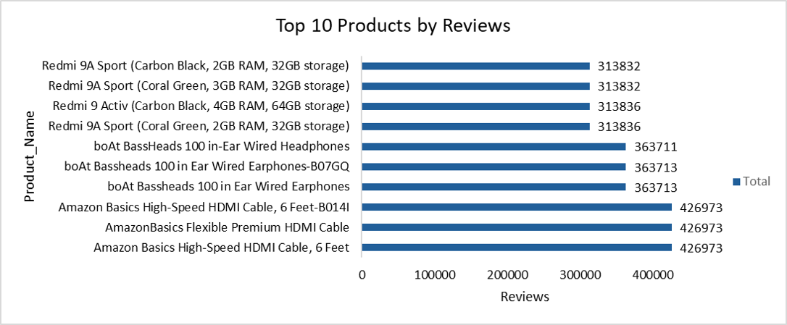
- **Q7: Products with ≥50% Discount**:
  - 662 products
  - Fixed 47 zero `discount_percentage` rows.
- **Q8: Rating Categories**:
  - Below 3 (0.0–2.9): 9
  - Average (3.0–3.9): 335
  - Good (4.0–4.4): 911
  - Excellent (4.5–5.0): 96
  - Majority in Average and Good, few in Excellent.
    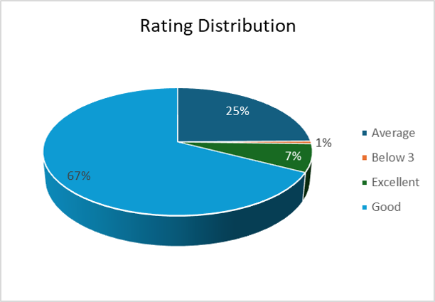
- **Q9: Revenue by Category**:
  - Electronics: ₹91,324,237,562
  - Computers & Accessories: ₹11,660,596,077
  - Used `short_category`.
    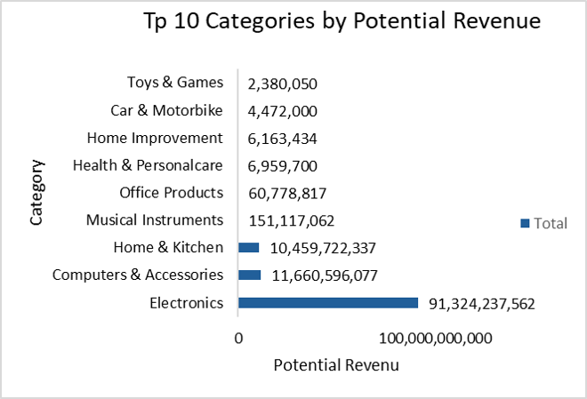
- **Q10: Products by Price Bucket**:
  - ₹500–₹2,000: 599
  - Used `price_bucket`.
    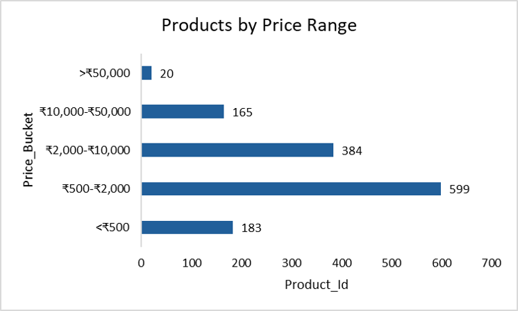
- **Q11: Correlation between Discount and Rating**:
  - Weak negative correlation (-0.16)
  - Fixed 47 zero `discount_percentage` rows.
- **Q12: Products with <1,000 Reviews**:
  - 308 products
- **Q13: Highest Discount Category**:
  - Computers & Accessories: 94%
  - Used `short_category`. Fixed 47 zero `discount_percentage` rows.
    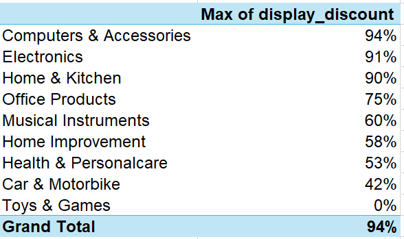
- **Q14: Top 5 Products by Combined Score**:
  - Amazon Basics High-Speed HDMI Cable, 6 Feet: 1,878,681
  - Amazon Basics High-Speed HDMI Cable, 6 Feet-B014I: 1,878,681
  - AmazonBasics Flexible Premium HDMI Cable: 1,878,681
  - boAt Bassheads 100 in Ear Wired Earphones-B07GQ: 1,491,223
  - boAt Bassheads 100 in Ear Wired Earphones: 1,491,223
  - Used `short_product_name`, edited duplicates, ties valid due to unique `product_id`.
    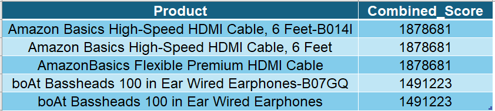

## Insights
-	High discounts (Q1, Q13) suggest aggressive promotions. Weak correlation (Q11) indicates discounts may slightly lower ratings. Tied `combined_score` in Q14 reflects similar product performance. Used `short_category` and fixed `rating` = 0, `discount_percentage` = 0 for clarity.

## Visuals
- Dashboard: 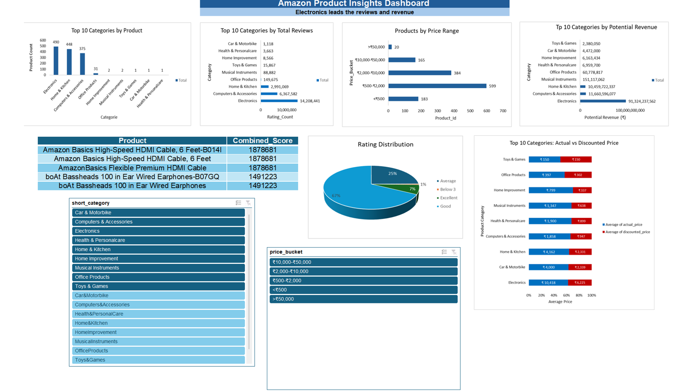
- Charts: Q2, Q3, Q4, Q5, Q6, Q8, Q9, Q10, Q14

## Conclusion
Cleaned dataset by resolving duplicates, text prices, long names, invalid ratings, and zero discounts using Excel 2019 with truncation, manual edits, and pivot table format fixes.

## Repository
-	[Link to GitHub repository]
## Files 
- [Excel Dataset](amazon_reviews.xlsx)

This project reflects my expertise in data cleaning, statistical analysis, and visualization, applicable to business intelligence and data analyst roles.
